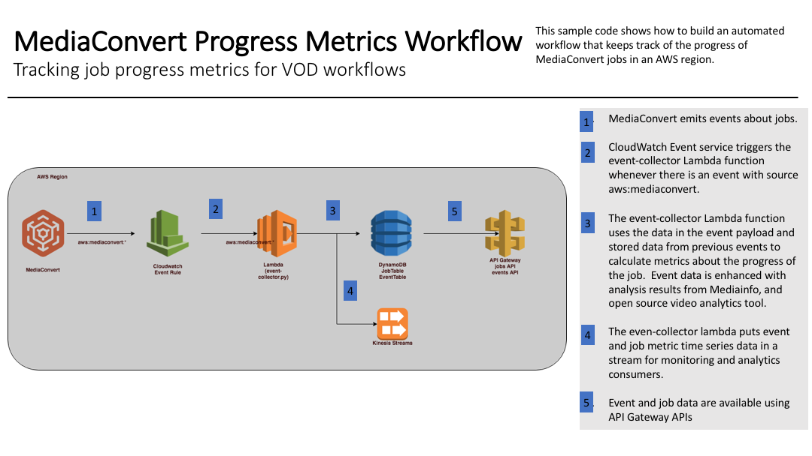

# Keep track of MediaConvert job status using CloudWatch Events

As with any application, observability is key to successful operation of video conversion workflows. Video conversion can be automated using various techniques such as watchfolders, web applications or batch processing.  Conversion jobs are created asynchronously and can be long running. Monitoring their progress is a task that is common to most automation scenarios.  For this purpose, MediaConvert provides CloudWatch events for tracking changes during the lifecycle of transcoding job resources.   

This sample code and AWS stack demonstrates how to keep track of MediaConvert job progress using [AWS Lambda](https://aws.amazon.com/lambda/), [Amazon CloudWatch Events](https://aws.amazon.com/cloudwatch) and [Amazon API Gateway](https://aws.amazon.com/api-gateway).  We'll use [Chalice](https://github.com/aws/chalice) to quickly create APIs.  Chalice is a python serverless microframework for AWS. It allows you to quickly create and deploy applications that use Amazon API Gateway and AWS Lambda.  We'll also use [mediainfo](https://mediaarea.net/en/MediaInfo), an open source video package analysis tool, to enhance the metadata provided by the MediaConvert events.

The data collected will help us answer questions like:

* What is the status of my MediaConvert job?
* How fast are my jobs progressing?
* How much of my job has been processed by MediaConvert?
* How long did my job take in diferent stages of processing?
* Did my job have to wait to be processed by MediaConvert because I had exceeded the capacity for the region?

After the job is complete, the metrics are available if you want to analyze your workload further.

We'll also lay the groundwork for adding monitoring and analytics by writing our metrics, events and intermediate job states as timeseries to a Kinesis stream.  The stream can be used to connect consumers that can use the data for monitoring our job workload over time. 




This repository contains sample code for the Lambda functions depicted in the diagram below as well as an [AWS CloudFormation](https://aws.amazon.com/cloudformation/) template for creating the function and related resources.

## Walkthrough of the Workflow
1. Other workflows in the AWS region run MediaConvert jobs to ingest videos for playback from AWS.

2. MediaConvert emits events about state changes in the job resources.

3. The CloudWatch Events service triggers the event-collector.py Lambda function each time there is a new event for a job resource.
  
4. The event-collector.py Lambda function keeps track of metrics about the progress of the job and stores the event and latest job metrics in DynamoDb.  The lambda also writes the current version of the job and event to a dynamodb stream so the timeseries data is available for other consumers (for workload monitoring).

1. Event and job progress data stored in Dynamodb are exposed to applications using an API Gateway API and Lambda function created using Chalice.

# Running the Sample

You will need to deploy the progress metrics collection stack and deploy the Chalice API.

## Prerequisites

MediaConvert workload: this stack monitors existing workloads in your account.  You will need a mechanism to create MediaConvert jobs either from the AWS console or another workflow in order to test this stack.

## Deploy the progress metrics stack

To get started right away just launch the stack using the button below.  You can also create your own deployment package using the instructions in the [Build a deployment package from the github repo](#build-a-deployment- package-from-the-github-repo) section later in this document.

Region| Launch
------|-----
US East (N. Virginia) | [](https://console.aws.amazon.com/cloudformation/home?region=us-east-1#/stacks/new?stackName=pipeline&templateURL=https://s3.amazonaws.com/elementalrodeo99-us-east-1/pipeline/pipeline-base/pipeline-base.yaml)

## Build the progress API

This project uses Chalice to build APIs.  Chalice is great for creating APIs with Lambda backends.  Learn more on the Chalice project pages [here](https://github.com/aws/chalice).

1. Setup the AWS CLI and make sure your `aws config` settings are set to the region and accont for your stack.
2. Setup a python3 virtualenv environment, vodtk, for developing in this project.  NOTE: you can name the virtualenv anything you want, but we will refer to it as vodtk in this example.

    ```
    virtualenv -p python3 <virtualenv-dir>/vodtk
    
    source <virtualenv-dir>/vodtk/bin/activate
    
    ```
1. Open the progress API folder and install the python dependencies for this lambda

    ```
    cd api-progress
    
    pip install -r requirements.txt
    ``
2. Find the output parameters from the pipeline cloudformation stack you created.  In the Cloudformation console, select the `pipeline` stack.  On the stack console page, choose the **Outputs** tab.  The outputs should be listed on the page. 

2. You will be using a pre-exisitng Chalice project that is already setup in this folder.  Open the Chalice configuration file, .chalice/config.json, in an editor.  Replace the values below with the values from the pipeline stack.   Then, replace the contents of the config.json with your JSON. 

    ```
    {
        "version": "1.0",
        "app_name": "api-progress",
        "environment_variables": {
            "EventTable": "<value of EventTable output>",
            "JobTable": "<value of JobTable output>"
            },
        "stages": {
            "dev": {
            "api_gateway_stage": "api",
            "manage_iam_role":false,
            "iam_role_arn":"<value of APILambdaRoleArn output>"
            }
        }
    }
    ```

3. Deploy the progress api

    ```
    chalice deploy
    ```
4. Output

    ```
    (vodtk) acbc32a255bd:progressapi burkleaa$ chalice deploy
    Creating deployment package.

    Creating lambda function: progressapi-dev
    Creating Rest API
    Resources deployed:
    - Lambda ARN: arn:aws:lambda:us-east-1:XXXXXXXXXXXX:function:progressapi-dev
    - Rest API URL: https://xxxxxxxxx.execute-api.us-east-1.amazonaws.com/api/
    ```

## Test the progress API

1. The workflow will automatically begin collecting metrics for any existing workload in the region.  If you don't have a workload running, run a MediaConvert job in whatever way you normally do it.  Make sure you run it in the region you deployed the stack in.
2. We'll test the API using httpie.  Install it if you don't already have it.  Or, you can test the API using another tool such a Postman.

    ```
    pip install httpie
    ```

2. List jobs by id

    ```
    http GET  https://xxxxxxxxx.execute-api.us-east-1.amazonaws.com/api/progress/job/1524854276176-osxgul
    ```

    Output:

    ```
    HTTP/1.1 200 OK
    Access-Control-Allow-Headers: Authorization,Content-Type,X-Amz-Date,X-Amz-Security-Token,X-Api-Key
    Access-Control-Allow-Origin: *
    Connection: keep-alive
    Content-Length: 769
    Content-Type: application/json
    Date: Fri, 27 Apr 2018 21:44:48 GMT
    Via: 1.1 e6b9bae86e720d09b3641b95c50c6c83.cloudfront.net (CloudFront)
    X-Amz-Cf-Id: KnmRs6Zu7K_cFysNCcQOINGPGFWF5H-aUfV_v_ccrCt2Pm1JAofYKw==
    X-Amzn-Trace-Id: sampled=0;root=1-5ae399d0-bf3f99a8625f31479d78521a
    X-Cache: Miss from cloudfront
    x-amz-apigw-id: GBT4mGthoAMFTeg=
    x-amzn-RequestId: 35530b72-4a64-11e8-9081-4d5ea40d12f6

    {
        "analysis": {
            "codec": "AVC",
            "frameCount": 7230.0,
            "num_inputs": 1.0,
            "num_outputs": 1.0
        },
        "createdAt": 1524854276.0,
        "eventTimes": {
            "completeTime": 1524854353.0,
            "createTime": 1524854276.0,
            "firstProgressingTime": 1524854276.0,
            "lastProgressingTime": 1524854353.0,
            "lastStatusTime": 1524854353.0,
            "lastTime": 1524854353.0
        },
        "filters": {
            "account": "XXXXXXXXXXX",
            "jobId": "1524866232400-dfjxlg",
            "queue": "arn:aws:mediaconvert:us-east-1:XXXXXXXXXXX:queues/Default",
            "queueName": "Default",
            "region": "us-east-1"
        },
        "id": "1524854276176-osxgul",
        "progressMetrics": {
            "decodeRate": 93.8961038961039,
            "estDecodeTimeRemaining": 0.0,
            "frameCount": 7230.0,
            "framesDecoded": 7230.0,
            "framesRemaining": 0.0,
            "percentComplete": 100.0,
            "progressingDuration": 77.0,
            "queuedDuration": 0.0,
            "statusDuration": 77.0
        },
        "status": "COMPLETE"
    }
    ```

3. List jobs with COMPLETE status.   

    ```
    http GET  https://xxxxxxxxx.execute-api.us-east-1.amazonaws.com/api/progress/status/COMPLETE
    ```

    Output:

    ```
    HTTP/1.1 200 OK
    Access-Control-Allow-Headers: Authorization,Content-Type,X-Amz-Date,X-Amz-Security-Token,X-Api-Key
    Access-Control-Allow-Origin: *
    Connection: keep-alive
    Content-Length: 1595
    Content-Type: application/json
    Date: Fri, 27 Apr 2018 22:00:38 GMT
    Via: 1.1 7cce0961450ef6caf68e8045176d0c0d.cloudfront.net (CloudFront)
    X-Amz-Cf-Id: Ad4J-TnlN4v7-0pC4Jknq2noFNVaAKS7CkJWwtbpvzz-biiy--oJaQ==
    X-Amzn-Trace-Id: sampled=0;root=1-5ae39d86-22702d7ae3e43b81f1551a7e
    X-Cache: Miss from cloudfront
    x-amz-apigw-id: GBWM-E0zIAMFyrg=
    x-amzn-RequestId: 6b50d881-4a66-11e8-9dbd-efd72347bccb

    [
        {
            "analysis": {
                "codec": "AVC",
                "frameCount": 7230.0,
                "num_inputs": 1.0,
                "num_outputs": 1.0
            },
            "createdAt": 1524866232.0,
            "eventTimes": {
                "completeTime": 1524866329.0,
                "createTime": 1524866232.0,
                "firstProgressingTime": 1524866262.0,
                "lastProgressingTime": 1524866329.0,
                "lastStatusTime": 1524866329.0,
                "lastTime": 1524866329.0
            },
            "filters": {
                "account": "XXXXXXXXXXX",
                "jobId": "1524866232400-dfjxlg",
                "queue": "arn:aws:mediaconvert:us-east-1:XXXXXXXXXXX:queues/Default",
                "queueName": "Default",
                "region": "us-east-1"
            },
            "id": "1524866232400-dfjxlg",
            "progressMetrics": {
                "decodeRate": 107.91044776119404,
                "estDecodeTimeRemaining": 0.0,
                "frameCount": 7230.0,
                "framesDecoded": 7230.0,
                "framesRemaining": 0.0,
                "percentDecodeComplete": 100.0,
                "progressingDuration": 67.0,
                "queuedDuration": 30.0,
                "statusDuration": 67.0
            },
            "status": "COMPLETE"
        },
        {
            "analysis": {
                "codec": "AVC",
                "frameCount": 7230.0,
                "num_inputs": 1.0,
                "num_outputs": 1.0
            },
            "createdAt": 1524854276.0,
            "eventTimes": {
                "completeTime": 1524854353.0,
                "createTime": 1524854276.0,
                "firstProgressingTime": 1524854276.0,
                "lastProgressingTime": 1524854353.0,
                "lastStatusTime": 1524854353.0,
                "lastTime": 1524854353.0
            },
            "filters": {
                "account": "XXXXXXXXXXX","jobId": "1524854276176-osxgul",
                "queue": "arn:aws:mediaconvert:us-east-1:XXXXXXXXXXX:queues/Default",
                "queueName": "Default",
                "region": "us-east-1"
            },
            "id": "1524854276176-osxgul",
            "progressMetrics": {
                "decodeRate": 93.8961038961039,
                "estDecodeTimeRemaining": 0.0,
                "frameCount": 7230.0,
                "framesDecoded": 7230.0,
                "framesRemaining": 0.0,
                "percentDecodeComplete": 100.0,
                "progressingDuration": 77.0,
                "queuedDuration": 0.0,
                "statusDuration": 77.0
            },
            "status": "COMPLETE"
        }
    ]

    ```
## Cleaning Up the Stack Resources

To remove all resources created by this example, do the following:

1. Delete the CloudFormation stack.
1. Delete the CloudWatch log groups associated with each Lambda function created by the CloudFormation stack.
2. Delete the Chalice api:
    ```
    cd api-progress
    chalice delete
    ```

## CloudFormation Template Resources
The following sections explain all of the resources created by the CloudFormation template provided with this example.

### Chalice API (API Gateway and Lambda function)

- **jobs API** A sample API implemented using Chalice, an AWS Serverless API framework, is provided.  Chalice lets you define API endpoints and lambda handler code in one python file.  It generates the AWS resources needed to support your code when you deploy your Chalice project.  It's super easy to use and great for getting your APIs up and running quickly.  Chalice will create a lambda function and API Gateway stages. The Chalice API is created separately from the stack, but takes stack resources as inputs.

### CloudWatch Events

- **AllMediaConvertEventRule** - an event rule that matches all aws:mediaconvert events for a regions and triggers the event collector lambda function

### DynamoDB

Dynamodb is used to persist the information we get from events so we can use them later.  In this design, Dynamodb is short term storage that is mostly useful to track the current state while the job is active.  It can be used to provide progress of jobs to application progress bars or to calculate new metrics.  For this reason, the default expiration is set to 1 day for the data in Dynamodb tables.  Other data stores are more appropriate for analytic tasks such as charting timeseries data or performing analysis on video asset metadata.

- **EventTable** - CloudWatch events that triggered the lambda.
- **JobTable** - Most recent job metrics calculated from event data for each job resource .

### IAM

- **APILambdaRole** - an IAM role with policies to give permission to APIs Lambdas to read from DynamoDB tables in the stack.

- **EventLambdaRole** - an IAM role with policies to give the EventCollectorLambda permission to access the account resources needed to colect and store event and job data.

- **StreamConsumerRole** - a role to be used by stream consumers to access event and job data

### Kinesis Streams

This stack is the "head" of a data pipeline.  Each event,change in jobs and metric is written to a stream where we can later attach consumers to use the data for other purposes.  For example, we can attach Elasticsearch to the stream so we can do timeseries analysis and dashboarding with Kibana, or we could attach S3 to the stream so we can archive our data.  We'll explore using the streams in other installments of this project.

You can set the expiration of stream data on the stack.   If you do not wish to use the streams you can remove it from your stack.  You'll also need to comment out the code that writes to the stream in the event-collector lambda.  

- **EventStream** - Events that triggered the Lambda 
- **JobStream** - Job state each time it is changed by a new event. 
- **MetricStream** - Individual metrics for job resources

### Lambda  

- **EventInvokeLambda** - a Lambda Permission that allows CloudWatch events to invoke the EventCollectorLambda lambda function.              

- **EventCollectorLambda** - Mediaconvert events trigger the event-collector lambda function.  The Lambda function does several things with MediaConvert events:

    * saves the raw events in a dynamodb table
    * enhances the data by performing analysis on the job such as mediainfo
    * calculates progress metrics for jobs
    * saves the most recent status of jobs and progress metrics in a Dynamodb table. 
    * saves event, job and metric data in a Kinesis stream  
   
### MediaConvert

MediaConvert is not triggered directly from this stack.  Instead, the stack is listening for events emitted from existing MediaConvert workloads in your account.

## Data

The data collected by the event collector is summarized below:

### Events table

* CloudWatch Events JSON for each event 

### Jobs table

Job Settings:
* response from MediaConvert create_job API call including job settings.

Job Analysis:
* total frames to be trancoded by the job
* mediainfo output of the job inputs

Job Metrics:
* most recent timestamp seen
* job status in [SUBMITTED, PROGRESSING, COMPLETE, ERROR]
* number of frames decoded
* speed of decoding in FPS
* percent complete of frames decoded
* estimated time remaining for decoding
* standby duration (duration in SUBMITTED status)
* PROGRESSING duration 

## Filters

Each event has the following key-value pairs that can be used to filter, join and aggregate the data.  Job data use the same filtering scheme:

```
"Account": <AWS Account ID>
"Region": <AWS Region>
"Queue": <MediaConvert Queue ARN>
"Job-Id": <MediaConvert Job ID>
"userMetadata": {"key1":<value1>, ..., keyn":<valuen>}
```

**userMetadata:** When you create a MediaConvert job, you can optionally pass along a dictionary of key-value pairs called userMetadata in the job settings JSON.  You can also set it from the console as shown in the screenshot below:

  

These key-value pairs get passed along whenever MediaConvert returns data to a user via events or API calls.  userMetadata can be used to associate application information with MediaConvert jobs.  For example, you might want to label a job with a user id, a session id, or an application id.  In the examples here we will include an "application" key-value pair in our userMetadata.

# Customizing the workflow

This section contains information about how to customize this stack.

## Filtering the events that progress metrics are collected for

The workflow is setup to collect metrics for any MediaConvert workload running in your region.  You could modify the CloudWatch event filter to limit metric collection using any of the event filters discussed in the **Data** section.  For example, to filter for only the events emited by the application called _Foo_ we could modify the CloudWatch events rule in [pipeline-base.yaml](./collector-mediaconvert-events/pipeline-base.yaml), _AllMediaConvertEventRule_, from this:

        EventPattern: 
            source: 
            - "aws.mediaconvert" 

To this:

        EventPattern: 
            source: 
            - "aws.mediaconvert"  
            userMetadata:
                application: 
                - "Foo"

## Build a deployment package from the github repo

If you want to modify this lambda code in this stack you'll need to generate your own deployment package with your changes.  Follow these steps to setup a deployment package using the files in this repository:

1. Obtain an AWS Lambda compatible copy of mediainfo.  You can download a version [here](https://s3.amazonaws.com/elementalrodeo99-us-east-1/pipeline/pipeline-base/mediainfo) or build your own using the instructions in the [Build mediainfo](#build-mediainfo) section below.  Place the copy of mediainfo in the <git-repo>/pipeline/pipeline-base/event-collector directory
2. Setup a virtualenv environment, vodtk,  for developing in this project

    ```
    virtualenv -p python3 <virtualenv-dir>/vodtk
    source <virtualenv-dir>/vodtk/bin/activate
    cd <git-repo>/pipeline/pipeline-base/event-collector
    pip install -r requirements.txt
    ```
2. Create a zipfile for the event-collector lambda

    ```
    export VIRTUALENV='<virtualenv-dir>/vodtk'
    export ZIP_FILE='lambda.zip'
    export PYTHON_VERSION='python3.6'

    DIR=`pwd`
    cd $VIRTUALENV/lib/$PYTHON_VERSION/site-packages/
    zip -r9 $DIR/$ZIP_FILE *
    cd $DIR 
    zip -g $ZIP_FILE *
    ```

3. Upload the lambda package to an S3 bucket located in the region you want to deploy to.
4. Edit the following lines in [pipeline-base.yaml](pipeline-base.yaml) to point to the S3Bucket and KeyPrefix you used to upload lambda.zip.

    ```
    Mappings:
    SourceCode:
        General:
        S3Bucket: "elementalrodeo99-us-east-1"
        KeyPrefix: "pipeline/pipeline-base"
    ```

1. From the AWS Management Console, click on **Services** and then select **CloudFormation**.
1. Select **Create stack** to go to the **Create stack** page
1. Select the **Upload a template to Amazon S3** checkbox then select **Choose file**
1. Navigate to the directory where you downloaded this git repository.  Then select **pipeline-base->pipeline-base.yaml**. Then select **Open**.
1. Select **Next** to move to the **Specify details** page.
1. Enter `pipeline` for the in the **Stack name** box.  Note: you can choose other stack names, but using "pipeline" will create resource with names consistent with the rest of the lab.
1. Select **Next** to move to the **Options** page.  Leave this page as defaults.
1. Select **Next** to move to the **Review** page.
1. Select the checkbox to acknowledge creating resources, then select **Create**
1. Wait for the stack to be created.
1. From the Stacks page, find the Stack called **pipeline**.


## Building mediainfo 

Do this step only if you want to build your own version of mediainfo.

### Step 1: Compile MediaInfo for Amazon Linux
To start, you need an instance running the same version of Amazon Linux as used by AWS Lambda. You can find the AMI for this version and for your region at Lambda Execution Environment and Available Libraries.

This instance is used only to compile MediaInfo and is terminated as soon as you finish this step. Any instance type is fine, but you may want to launch at least a t2.medium for compiling software that is fairly CPU intensive. On a t2.medium, MediaInfo compiles in about 2 minutes.

Here is a sample command to launch an instance in US East (N. Virginia):

```
aws ec2 run-instances \
    --image-id ami-60b6c60a \
    --count 1 \
    --instance-type t2.medium \
    --key-name YourKeyPair \
    --security-group-ids sg-xxxxxxxx \
    --subnet-id subnet-xxxxxxxx
```
After you have launched your instance, SSH into it. For more information, see Getting Started with Amazon EC2 Linux Instances.

After you connect to the instance, execute the following commands. These commands install the necessary libraries to compile MediaInfo, download and extract the MediaInfo source code, and finally compile MediaInfo into a static binary.

1. Install Development Tools necessary to compile MediaInfo
    ```
    sudo yum groupinstall 'Development Tools'
    ```
2. Install library required to add CURL support to Mediainfo
    ```
    sudo yum install libcurl-devel
    ```

3. Download MediaInfo
    ```
    wget http://mediaarea.net/download/binary/mediainfo/0.7.84/MediaInfo_CLI_0.7.84_GNU_FromSource.tar.xz
    ```

4. Untar MediaInfo
    ```
    tar xvf MediaInfo_CLI_0.7.84_GNU_FromSource.tar.xz
    cd MediaInfo_CLI_GNU_FromSource
    ```

5. Compile MediaInfo with Support for URL Inputs

    ```
    ./CLI_Compile.sh --with-libcurl
    ```

Notice that version 0.7.84 of MediaInfo is being downloaded. That is the latest version as of this post. You can find the current source code at Download – Sources on the MediaInfo website.

MediaInfo is being compiled with the “–with-libcurl” option. This option adds URL support to MediaInfo and allows you to pass a URL as an input. This is important later when it is time to access files on S3.

After the compile is complete, a static, standalone version of MediaInfo is created. Run the following two commands to confirm successful compilation:

```
cd MediaInfo/Project/GNU/CLI
./mediainfo --version
```

You should get an output that looks like the following:

```
MediaInfo Command line,
MediaInfoLib - v0.7.84
```

You now need to copy the MediaInfo executable off the instance and down to your local workstation in the event-collector folder of this git repository. 

<REPO>/data-pipeline/pipeline-base/event-collector

Later, you bundle this executable with your Lambda function. You can use any convenient method to download: e.g., scp, ftp, copy to S3, etc.

## License

This sample is licensed under Apache 2.0.

