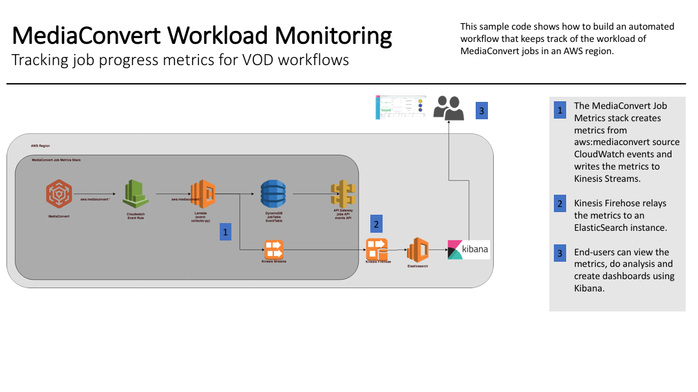
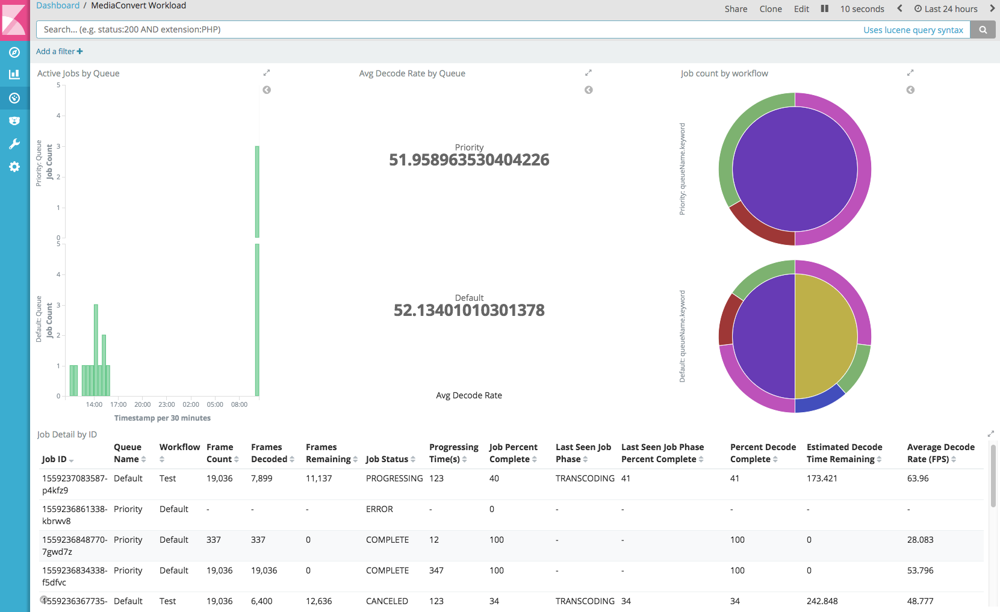

# Monitoring MediaConvert Workloads using CloudWatch Events, Kinesis, and Elasticsearch

Observability is key to effectivily operating any workflow on AWS.  In the previous module, we kept track of the progress of MediaConvert jobs over time and exposed it as an API that could be called from web applications.  In this module, we'll be using the same data, but we'll be combining all of our job data to provide information about our transcoding workload as a whole. We'll use Kinesis Firehose to consume job progress metrics from a stream and Elasticsearch and Kibana to search and aggregate the data and visualize our workloads.

In this architecture, we set up a data pipeline where the [MediaConvert Job Progress Metrics](../MediaConvert-JobProgressMetrics/README.md) stack from the previous module is the _producer_ and the Elasticsearch stack is the _consumer_.

# Stack Resources

**MediaConvert Progress Metrics stack:** We'll use the data produced from the Job Progress Metrics stack.

**Kinesis Firehose:** A Kinesis firehose is created for each kind of data that is collected in the progress stack: events, jobs and metrics.  The firehose is configured to deliver data to an Elasticsearch instance.  The firehose is also configured to deliver data to S3 if delivery to Elasticsearch fails. 

**Elasticsearch:** Elasticsearch is used to perform filtering, timeseries analysis and aggregation of job data so we can view information about our workload.  

**Elasticsearch Index Custom Resources:** Custom resources are included in the stack to create index mappings for each of the data types generated from the Progress Metrics stack: events, jobs and metrics.

## Costs

This sample uses AWS services that do not provide a free tier.  These include Kinesis, Kinesis Firehose and Elasticsearch.  The billing will depend on the amount of data that is present in your pipeline.  The amount of data will vary depending on your MediaConvert workload.

# Running the example

## Prerequisite

1. You'll need to deploy the the progress monitoring stack in [MediaConvert-JobProgressMetrics](../MediaConvert-JobProgressMetrics/README.md) that will be the producer of the data in our pipeline.  You will not need the progress REST API, so you can skip that step if you want.

2. MediaConvert workload: This workflow monitors the existing MediaConvert workloads in your account.  If you do not have any MediaConvert jobs running, there will be no data in the dashboard.

## Deploy the stack 

 To get started right away just launch the stack using the button below.  You can also create your own deployment package using the instructions in the [Build a deployment package from the github repo](#build-a-deployment- package-from-the-github-repo) section later in this document.

Region| Launch
------|-----
US East (N. Virginia) | 

1. Fill in the input parameters for the stack using the outputs from the `pipeline` stack you created previously.

## Configure Kibana

1. Use the link in the KibanaUrl stack output to open the Kibana console created by your stack.  

3. You should end up on a page that looks like this:

    

### Create index patterns for event, job and metric data

4. You'll need to configure an index pattern for Jobs, Metrics and Events so we can visualize them in Kibana.
5. For the Events index type `eventindex-*` in the **Index name or pattern** box.
6. Select `time` as the **Time Filter field name**.
7. Click on the **Create button**
8. Select the **Create Index Pattern** button to create another index pattern
7. Type `jobindex-*` in the **Index name or pattern** box.
6. Select `createdAt` as the **Time Filter field name**. 
7. Click on the **Create button**
8. Select the **Create Index Pattern** button to create another index pattern
7. Type `metricindex-*` in the **Index name or pattern** box.
6. Select `Timestamp` as the **Time Filter field name**. 
7. Click on the **Create button**

### Import the sample dashboard

1. Select the **Management** tab from the Kibana side bar menu.
2. Select **Saved Objects** from the top of the panel
3. In the Saved Objects page, select the **Import** button.
4. Navigate to the directory `REPO/pipeline/pipeline-es/dashboards` and select the file `workload-dashboard.json`
5. Select **Open** and accept the warning message about overwritting duplicate objects.

    

6. Open the imported dashboard by selecting **Dashboard** from the Kibana sidebar menu.  Select the dashboard `MediaConvert Workload (last 1 hour)` from the list.

    

7. You may need to adjust the time picker in the upper right corner to select the last hour of data.  Click on the timepicker and select the **Quick** menu.  Then select **Last 1 hour** from the choices presented.

    

